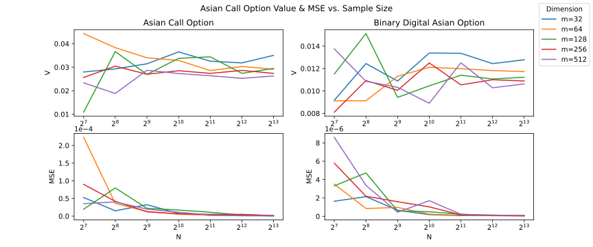

# high-dimensional-integration
 


The strike price in Asian option payoff functions causes "jumps", which hinder our capabilities in estimating the Quasi Monte Carlo method's error.

The goal of this project is to use preintegration and variance reduction techniques to obtain higher accuracy for the QMC error estimates.

Together with [Naoki Sakai](https://github.com/Naokikiki), this project was done as part of the "Stochastic Simulation" course at EPFL. Here is a [link to the report](.figures/paper.pdf). 

## Theory overview

We model the stock price $S$ with a stochastic differential equation
```math
dS=rSdt+\sigma Sdw_{t}, \quad S(0)=S_{0}
```

where 
- $S(t)$: the stock price at time $t$,
- $r$: the interest rate,
- $\sigma$: the volatility of the stock price, and
- $w_{t}$: a standard one-dimensional Wiener process.

and find that it yields the solution
```math
S_{t}=S_{0}\exp{\left( t\left( r-\frac{\sigma^{2}}{2} \right)+\sigma w_{t} \right)}
```

Now to simulate the stock price, we simulate a discretized Brownian motion path $\mathbf{w}=(w_{t_{1}},w_{t_{2}},\dots,w_{t_{m}})$, which is an $m$-dimensional vector.

The Asian option payoffs are given by:

- (Asian call option): $\Psi_{1}(\mathbf{w}):=\phi(\mathbf{w}) \mathbb{I}_{\{\phi(\mathbf{w})\}}$
- (Binary Digital Asian Option): $\Psi_{2}(\mathbf{w}):=\mathbb{I}_{\{\phi(\mathbf{w})\}}$

where 
```math
\phi(\mathbf{w}):=\frac{1}{m} \sum^{m}_{i=1}S_{t_{i}}(w_{t_{i}})-K
```
and 
- $S_{t_{i}}$ is the stock price at time $t_{i}$ 
- $K$ is the strike price

The value of these option payoffs can be calculated with the following $m$-dimensional integral
```math
V_{i}:=e^{-rT}\mathbb{E}\left[ \Psi_{i}(\mathbf{w} ) \right] =\frac{e^{-rT}}{(2\pi)^{m/2}\sqrt{ \det C }}\int _{\mathbb{R}^{m}} \Psi_{i}(\mathbf{w} )e^{-\frac{1}{2}\mathbf{w} ^{\top}C^{-1}\mathbf{w} }\, d\mathbf{w}
```

where, in order of appearance we have
- $r$: the interest rate,
- $T$: the maturity of the option,
- $\Psi_{i}$: the Asian option payoffs (defined above),
- $\mathbf{w}=(w_{t_{1}},w_{t_{2}},\dots,w_{t_{m}})$: the discretized Brownian motion stock prices at times $t_{i}=i\Delta t$ with $\Delta t=\frac{T}{m}$, and
- $C$: the covariance matrix of $\mathbf{w}$ defined by $C_{i,j}=\min\{ t_{i},t_{j} \}$.


